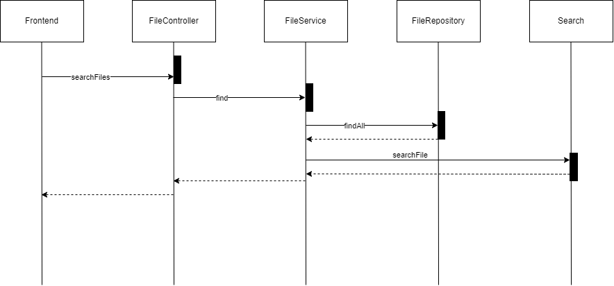

# JVM_Quesadilla

## What is JVM_Quesadilla?
JVM_Quesadilla is a file searching tool that is  written in Kotlin. The UI let's you set a path, for which point in the fs it should start caching everything, and then search for files which are in set cached directory.

## Link to the frontend Repository

[Frontend](https://github.com/mariotraub/JVM_Quesadilla_Frontend)

## UML Diagram at the beginning of the project


## Projekt starten
1. Datenbank starten: 
```bash
docker compose up
```
2. Projekt Starten
```bash
./gradlew bootRun
```
3. Frontend Starten
https://github.com/mariotraub/JVM_Quesadilla_Frontend

## Design Pattern
Bei [Search.kt](src/main/kotlin/jvm/quesadilla/search/Search.kt) haben wir das Design Pattern Singleton benutzt.
Wir haben uns dafür entschieden,
weil man von überall aus darauf zugreifen können soll und es nicht nötig ist,
dass es mehrere Instanzen davon gibt,
weil es sich nur um Utility functions handelt.

Dank Kotlin konnten wir dieses Pattern sehr einfach mit dem `object` Keyword umsetzen.

## Sequenz Diagramm
Dieses Sequenz Diagramm zeigt was passiert, wenn man im Frontend nach einem File sucht:


## UML Diagramm zum Ende des Projekts
Man sieht, dass sich am Grundlegenden Plan nicht sehr viel geändert hat:

MARCO -> TODO
